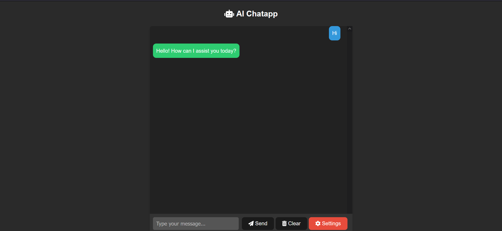

# React Chat App Template for Azure OpenAI Integration

This template provides a starting point for building a chat application that integrates with Azure OpenAI. The app allows users to interact with an AI chatbot, and it includes a customizable Settings popup for users to input their Azure OpenAI API details.

## Features

- **Chat with an AI Assistant:** Users can send and receive messages with an AI assistant.
- **Customizable API Settings:** Users can configure their Azure OpenAI API details using the "Settings" popup.



## Getting Started

1. **Clone the Repository:**

   ```bash
   git clone https://github.com/akashchaudhary-git/react-js-azure-openai-chat-app.git
   cd react-js-azure-openai-chat-app
   ```

2. **Install Dependencies:**

   ```
   npm install
   ```

3. **Run the App:**

   ```
   npm run dev
   ```

## Integration with Azure OpenAI

To integrate the app with your Azure OpenAI resource:

Configure API Settings:

- Click the "Settings" gear icon.
- Enter your Azure OpenAI API URL and API Key.
- Click "Save" to apply the changes.

Start Chatting:

- Type your message in the input field and click "Send" to chat with the AI assistant.

### Customize and Extend

Feel free to customize the app based on your specific requirements. The structure is designed to be modular, making it easy to add new features or modify existing ones.
